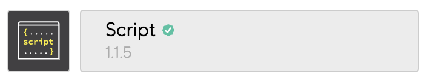
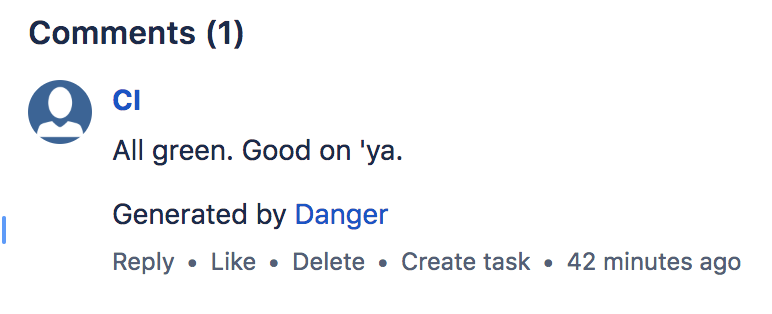

A team I have been working with recently has grown to a big enough size that we decided to improve the pull request (PR) process with continuous integration (CI) by introducing Danger.

> [Danger](https://github.com/danger/danger) runs during your CI process, and gives teams the chance to automate common code review chores.

Getting started with Danger can be fairly simple, depending on where you host your repository, and what CI tool you use. 
I setup Danger to run on a Bitbucket repository using Bitrise CI. 
_note - danger requires Ruby._

##Step 1 - Create your Gemfile

Run `bundler init` to create a `Gemfile` in your project.

Add the danger gem to the `Gemfile`.

```ruby
gem 'danger'
```

The gemfile is used by Ruby to declare a list of dependencies. This is where we will add our plugins to Danger.

##Step 2 - Install Danger
Install the Danger gem.
```ruby
bundle install
```

##Step 3 - Create a Dangerfile
Create a file called `Dangerfile` in the root of your project.
To start with, add a basic 'hello world' to the Dangerfile.
```ruby
message("Hello world")
```

##Step 4 - Integrate with CI

This step is a guide to integrating with [Bitrise](https://www.bitrise.io/). 

Add a `Script` step to your workflow after your gradle build has completed:



```bash
#!/usr/bin/env bash
# fail if any commands fails
set -e
# debug log
set -x

ghprbPullId=${PULL_REQUEST_ID}
bundle install
bundle exec danger --verbose
```
This installs Danger, and executes it. Executing danger will run your Dangerfile and output a report as a comment on the PR.

`ghprbPullId` - I had issues using the bitbucket cloud integration which was fixed by adding [this](https://github.com/danger/danger/issues/763#issuecomment-288801845).


Add your bitbucket credentials as environment variables:
```
DANGER_BITBUCKETCLOUD_USERNAME
DANGER_BITBUCKETCLOUD_PASSWORD
```

I would suggest you create a new user in Bitbucket to use for CI. This means you can set a sensible name and avatar to make it clearer what is commenting on their PR.

At this point, assuming you have PR triggers set up in Bitrise, you should be able to create a PR in Bitbucket and get Danger output as a comment.



##Step 5 - JUnit 
Add `gem 'danger-junit'` to your `Gemfile`

Add the following to your `Dangerfile`

```ruby
junit_tests_dir = "**/test-results/**/*.xml"
Dir[junit_tests_dir].each do |file_name|
  junit.parse file_name
  junit.report
end
```

This section processes each of the JUnit report XML files.
As I was working on a multi module project the wildcard search finds all the applicable JUnit test reports to process.

##Step 6 - Android Lint
Add `gem 'danger-android_lint'` to your `Gemfile`

Add the following to your `Dangerfile`

```ruby
lint_dir = "**/reports/lint-results.xml"
Dir[lint_dir].each do |file_name|
  android_lint.skip_gradle_task = true
  android_lint.filtering = true
  android_lint.report_file = file_name
  android_lint.lint
end
```

This will update the report based on the output from your lint checks.
This requires the `lint` gradle task to be executed.


`android_lint.filtering = true` - only displays the lint result of files modified in the PR, this helps to reduce noise if you are working on a large project.

##Step 7 - Checkstyle
If you are running [checkstyle](https://github.com/checkstyle/checkstyle) to maintain code formatting / code standards in your repository you can use this plugin to display checkstyle reports in your PR.

Add `gem 'danger-checkstyle_format'` to your `Gemfile`

Add the following to your `Dangerfile`

```ruby
checkstyle_dir = "**/checkstyle/checkstyle.xml"
Dir[checkstyle_dir].each do |file_name|
  checkstyle_format.base_path = file_name
  checkstyle_format.report file_name
end
```

Again, as I am running a large multi module project I am iterating over the checkstyle output files from every module.

##Challenges

####Offline mode
Currently offline mode `danger pr` only works with GitHub repositories.


####Token authorisation
Danger does not support bitbucket authentication with a token.


## Links
https://blog.bitrise.io/danger-danger-uh-that-is-using-danger-with-bitrise

https://danger.systems/guides/getting_started.html

https://github.com/orta/danger-junit

https://github.com/loadsmart/danger-android_lint

https://github.com/noboru-i/danger-checkstyle_format

https://github.com/Malinskiy/danger-jacoco

https://medium.com/@emmaguy/tracking-android-app-metrics-431cbea2113d

https://github.com/danger/awesome-danger

https://github.com/operando/AndroidDangerSample/blob/master/Dangerfile

https://medium.com/@p.tournaris/building-a-helpful-android-ci-with-danger-jenkins-bf751be7a74c